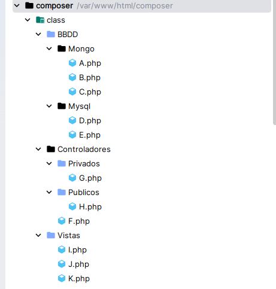

+++
title = 'Composer'
date = 2024-10-15T07:04:49+02:00
draft = false
icon = "fas fa-box"
weight = 160
+++


Comprender qué es Composer y su papel en el ecosistema PHP  
Entender cómo gestiona dependencias externas  
Aprender cómo funciona el sistema de autoload  
Diferenciar classmap y PSR-4  
Relacionar namespaces con estructura de directorios  


## ¿Qué es Composer?

Composer es el gestor de dependencias estándar de PHP.

Del mismo modo que un **director de orquesta** coordina los instrumentos para que la música suene de forma armoniosa, **Composer** actúa como un **orquestador del proyecto PHP**.

Su función principal es gestionar de forma unificada todos los **paquetes, librerías y dependencias** que una aplicación necesita para funcionar correctamente.

---

## ¿Qué hace Composer?

Entre sus funciones principales, Composer permite:

- Instalar y actualizar **librerías y paquetes de terceros** de forma controlada.
- Resolver automáticamente las versiones compatibles entre dependencias.
- Generar el sistema de **carga automática (autoload)** para las clases del proyecto y sus dependencias.

Composer **no ejecuta las clases ni interpreta el código**.  
Su función es generar la infraestructura necesaria para que PHP pueda localizar y cargar las clases cuando se necesiten.

---
### Instalación de composer
* Toda la información en la página oficial https://getcomposer.org/
* El proceso de instación en windows consiste en descargar un fichero ejecutable e instalarlo
* En linux, para acceder a la última versión lo mejor es descargarse el fichero de su página oficial

  php -r "copy('https://getcomposer.org/installer', 'composer-setup.php');"
  php -r "if (hash_file('sha384', 'composer-setup.php') === 'c8b085408188070d5f52bcfe4ecfbee5f727afa458b2573b8eaaf77b3419b0bf2768dc67c86944da1544f06fa544fd47') { echo 'Installer verified'.PHP_EOL; } else { echo 'Installer corrupt'.PHP_EOL; unlink('composer-setup.php'); exit(1); }"
  php composer-setup.php
  php -r "unlink('composer-setup.php');"

  * Esto descarga y crea un ejecutable en la carpeta llamado composer.phar
  * Ahora lo copiamos a un directorio que esté en el path del sistema

    sudo mv composer.phar /usr/local/sbin/composer

  
## El fichero composer.json

Composer utiliza el fichero `composer.json` como **descriptor del proyecto**.

En él se definen:

- Las dependencias (`require`)
- Las reglas de autoload (`autoload`)
- Metadatos como autor, versión o licencia
- Scripts y configuraciones adicionales

Ejemplo básico:


{
    "require": {
            "monolog/monolog": "^3.0"
     },
    "autoload": {
        "psr-4": {
            "MiProyecto\\": "src/"
         }
    }
}


---

## El problema que resuelve el autoload

Sin autoload, deberíamos incluir manualmente cada archivo:


require 'Clases/Usuario.php';
require 'Clases/Producto.php';
require 'Clases/Pedido.php';


Problemas:

- Código repetitivo
- Posibles olvidos
- Dificultad de mantenimiento
- Escasa escalabilidad

Con Composer, solo necesitamos:


require "vendor/autoload.php";


Ese archivo registra internamente una función mediante `spl_autoload_register()` que permite a PHP cargar automáticamente las clases cuando se instancian.

---

*Supongamos que tenemos esta estructura de proyecto

Cada clase simplemente tiene el código con el __toString()

class A{
    public function __toString(){
        return "<h2>Estoy en la clase " . __CLASS__ . "</h2>";
    }
}

*En el index queremos instanciar cada clase

<?php
//Aquí faltaría la autocarga

$a = new A();
$b = new B();
$c = new C();
$d = new D();
$e = new E();
$f = new F();
$g = new I();
$h = new J();
$i = new I();
$j = new J();
$k = new K();

echo $a;
echo $b;
echo $c;
echo $d;
echo $e;
echo $f;
echo $g;
echo $h;
echo $i;
echo $j;
echo $k;




# Usando Composer con *classmap*

## ¿Cómo funciona classmap?

Composer escanea los directorios indicados y genera un **mapa estático** que asocia cada clase con su ruta exacta.

## Configuración en composer.json


{
    "autoload": {
        "classmap": [
                "Clases"
        ]
    }
}


## Generar el autoload


    composer install


o


    composer update


Al ejecutar estos comandos, Composer crea la carpeta `vendor/` y genera el fichero `vendor/autoload.php`.

Si añadimos nuevas clases usando classmap, debemos regenerar el mapa:


    composer dumpautoload


---

# Usando PSR-4

PSR-4 es el método moderno y recomendado de autocarga.

Se basa en una relación directa entre:

- Namespace
- Estructura de directorios

## Configuración en composer.json


{
    "autoload": {
        "psr-4": {
            "MiProyecto\\": "src/"
           }
        }
}


Esto significa que:

- Las clases con namespace `MiProyecto` se cargarán desde la carpeta `src/`.

---

## Espacio de nombres (namespace)

Un **namespace** permite organizar clases, funciones e interfaces evitando conflictos de nombres.

Ejemplo:


    namespace MiProyecto\Modelos;


Debe ubicarse en:

    src/Modelos/Usuario.php


Composer resuelve la ruta del fichero aplicando reglas de transformación entre namespace y estructura de directorios.

Si añadimos nuevas clases dentro de esa estructura, **no es necesario regenerar el autoload**, siempre que no modifiquemos `composer.json`.

---

### Comparativa: classmap vs PSR-4

#### classmap

**Cómo funciona**

Genera un mapa estático clase → ruta.

**Ventajas**

- Muy sencillo
- No requiere namespaces
- Útil en proyectos heredados

**Inconvenientes**

- Requiere regenerar el mapa al añadir clases
- No impone estructura modular

---

#### PSR-4

**Cómo funciona**

Transforma automáticamente namespace en ruta de archivo.

**Ventajas**

- Estándar moderno
- Escalable y modular
- No requiere regenerar al añadir clases (si no cambia composer.json)
- Facilita evitar conflictos de nombres

**Inconvenientes**

- Requiere usar namespaces
- Obliga a mantener coherencia estructural

---



El autoload no es solo comodidad,  **Es un mecanismo estructural que:**

_- Impone organización_
_- Facilita la escalabilidad_
_- Estandariza la arquitectura del proyecto_

 **PSR-4 es el estándar utilizado por Laravel, Symfony y la mayoría del ecosistema PHP moderno.**
